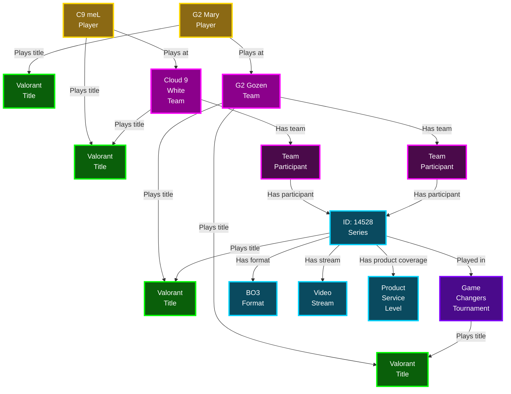

<Badge color="green">Commercial Access</Badge> <Badge color="blue">Competitor Access</Badge> <Badge color="gray">Open Access</Badge>

Series, players, teams, titles and tournaments are the primary entities in the Central Data API.

## Relationships
Entities in the Central Data API are interconnected and can be represented as nodes in a graph. The relationship between entities is denoted by edges. Additional information about the relationship is included in the relationship fields (for example, `scoreAdvantage` for a team participant relationship on the series entity).

For example, in a best-of-three series between C9 White and G2 Gozen for Valorant Game Changers, a Series entity can be linked to several other entities to obtain their respective data.

## Series
A Series represents a minimum of one game played by two teams in a tournament context. The Series entity in the Central Data API does not track in-game events. Instead, it records data points related to scheduling, context, and format.
#### Related entity: Series Format
The format of a series determines the number of games played and how the winner is determined. For example, BO1 and BO3 formats (respectively, "best-of-1" and "best-of-3") indicate that one or up to three games are played. The winner of a BO1 series wins with one game, and the winner of a BO3 series wins with two games.
#### Related entity: Product Service Level
The service level indicates the type of coverage GRID offers for a given series in each product. The value of this field can be `FULL`, `LIMITED`, or `NONE`.
#### Related entity: Video Stream
The video stream entity provides the URL for a series's live video stream.

## Teams
Teams identify groups of players participating in games.
#### Related entity: Team Participant
You can find this entity in Series. It contains the information of the team, alongside the score advantage for a given series.

## Players
Players represent the individuals participating in games. The Central Data API uses this entity to keep track of players between different matches consistently.

## Titles
Titles describe the games supported by GRID. For example, Valorant, CS:GO, and DotA are supported titles. Titles play an important role in defining the Central Data API. While all GRID APIs are title-agnostic, events and states may have small differences between titles to express the game state fully.

## Tournaments
Tournaments are competitions in which teams participate.

